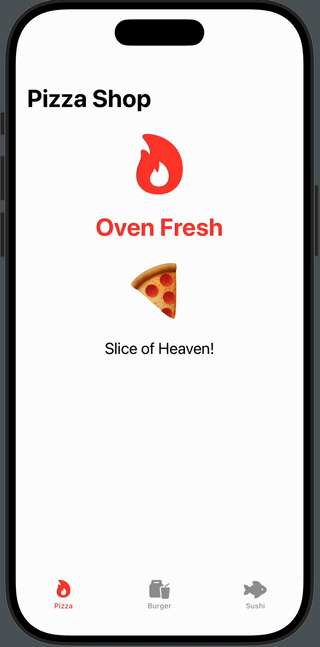

# Food Tab View App
A SwiftUI app showcasing food-themed tab views with food emojis

## Assignment Details
- **Assignment**: Homework 11
- **Course**: CIS-137 iOS/Swift Programming
- **Developer**: David Deng
- **Date**: October 27, 2024

## Features
- Three food-themed tabs (Pizza, Burger, Sushi)
- Large food emojis on each page
- Themed system images and colors for each food type
- Tab navigation with TabView

## Food Themes
- **Pizza Shop** - Red theme with flame.fill icon
- **Burger Joint** - Brown theme with takeoutbag.and.cup.and.straw icon  
- **Sushi House** - Blue theme with fish.fill icon

## How to Use
1. Launch the app to see the food-themed tab bar
2. Switch between Pizza, Burger, and Sushi tabs
3. Enjoy the large food emojis and themed designs on each page :)

## Technical Details
- Built with SwiftUI
- Uses TabView for navigation
- NavigationView for each tab content
- SF Symbols for food-themed icons
- Large emoji displays for visual appeal

## Setup
1. Open `Homework11.xcodeproj` in Xcode
2. Run on iPhone simulator or device
3. Switch between tabs to see the different food themes

## Requirements Completed
- SwiftUI project with proper documentation headers
- Three food-themed tabs with custom content
- System images (flame.fill, takeoutbag.and.cup.and.straw, fish.fill) for tab icons
- Themed colors and decorations for each food type
- README file with project description
